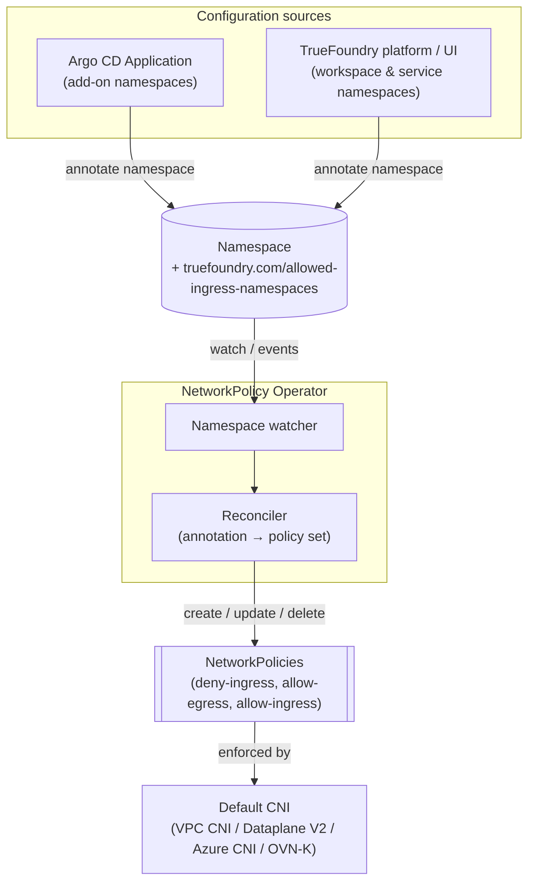
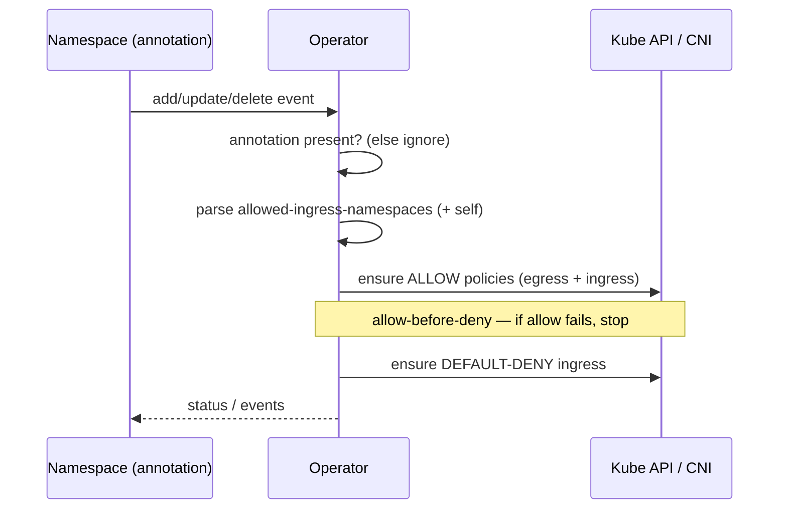

# NetworkPolicy Operator — High-Level Design & Architecture

> Scope: an annotation-driven operator that manages ingress NetworkPolicies for TrueFoundry-managed namespaces (add-ons and workspace/service namespaces). Egress stays open. Default CNI only (AWS VPC CNI, GKE Dataplane V2, Azure CNI, OVN-Kubernetes).
>
> Status: **HLD / architecture**. The detailed solution (reconcile logic, CRD/annotation parsing, edge cases) will follow as an LLD.

## 1. Objective

Add explicit, namespace-level network segmentation across the TrueFoundry ecosystem as a defense-in-depth measure: **default-deny ingress**, allow only declared sources, keep **egress open**. Configuration is driven by a **single namespace annotation** — no labels are required from the platform.

## 2. Design principles

1. **Single-annotation contract.** One annotation on a namespace fully describes its desired policy: its **presence** enrolls the namespace and its **value** lists the allowed ingress sources.
2. **Opt-in.** The operator only touches namespaces that carry the annotation; absent it, the namespace is untouched. System namespaces are excluded by denylist as well.
3. **Ingress-only, egress-open.** The operator never restricts egress.
4. **Standard objects only.** It emits core `networking.k8s.io/v1` NetworkPolicy objects that every default CNI enforces — no CNI-specific CRDs.
5. **Declarative & GitOps-friendly.** The annotation is set by the same Argo CD Application / platform template that creates the namespace.

## 3. Annotation model

A **single** annotation forms the entire input contract. Its **presence** is the enrollment signal; its **value** is the allow-list.

| Annotation | Purpose | Example value |
|------------|---------|---------------|
| `truefoundry.com/allowed-ingress-namespaces` | Enroll the namespace **and** declare which source namespaces may send ingress (comma-separated). `self` (same namespace) is always implied. | `argocd,prometheus` |

Behaviour by annotation state:

| Annotation state | Operator behavior |
|------------------|-------------------|
| **Absent** | Namespace ignored — no policies created (not enrolled). |
| **Present, empty** (`""`) | Default policies only: default-deny ingress + default-allow egress + allow `self`. |
| **Present, with list** (`"argocd,prometheus"`) | The above **plus** allow ingress from each listed namespace. |

> Two notes:
> - **Presence = opt-in.** To enroll a namespace (even with defaults only) the annotation must be set, possibly empty. Absent = not managed. This keeps rollout explicit and per-namespace.
> - **`namespaceSelector` matches labels, not annotations.** The operator translates each listed namespace **name** into a selector on the built-in `kubernetes.io/metadata.name` label (present on every namespace, k8s 1.21+). The annotation is the operator's **input** on the managed namespace only.

## 4. Architecture

**Components**

- **Namespace watcher** — watches all namespaces; filters to those carrying the annotation (system namespaces are hard-excluded by denylist).
- **Reconciler** — converts the annotation into the desired set of NetworkPolicies for that namespace and drives the cluster to match (create/update/delete).
- **Default CNI** — enforces the generated policies. The operator produces only standard objects; enforcement is delegated to the platform CNI.

**What the operator produces (per managed namespace)** — three standard NetworkPolicies:

1. `default-deny ingress`
2. `default-allow egress`
3. `allow ingress` from `self` + listed namespaces

(Exact manifests and parsing rules are defined in the LLD.)

## 5. Reconciliation flow

Ordering is **allow-before-deny**: the allow policies are created/ensured first, then default-deny, so legitimate traffic is never dropped during reconcile.

## 6. Delivery model

| Part | How the annotation gets set |
|------|------------------------------|
| **Add-ons** (`argocd`, `keda`, `prometheus`, `istio`, `tfy-agent`, `tfy-logs`) | The Argo CD Application that deploys the add-on sets the annotation on its namespace. Posture is declarative and GitOps-managed. |
| **Workspaces & services** | The TrueFoundry platform sets the annotation when it generates the namespace/deployment (UI "Network Policy" section selecting `service:workspace` sources). Mostly v2. |
| **Control plane** | Already covered by the `truefoundry` Helm chart's built-in NetworkPolicies (out of scope for the operator). |

## 7. Key design considerations

- **Single annotation = enroll + config.** Presence enrolls; value configures. To enroll with defaults, set the annotation empty (`""`). "Absent" means "not managed" — so a managed namespace cannot also be explicitly "managed but NP-off"; omit the annotation instead. This overloads presence/empty-value with two meanings, accepted for contract simplicity.
- **Annotations can't be used as a `watch` label-selector**, so the operator watches all namespaces and filters by annotation in code. At platform scale (tens–hundreds of namespaces) this is negligible. Benefit: no new labels imposed on the platform; an annotation also holds the variable-length allow-list a label cannot.
- **`namespaceSelector` uses labels internally** (see §3 note) — the annotation is operator input only; generated policies still rely on the built-in `kubernetes.io/metadata.name` label of source namespaces.
- **Egress stays open** — the operator never sets a restrictive egress policy; pod-initiated outbound calls (DB, cloud, DNS, IMDS) and their stateful responses are unaffected.
- **Non-pod ingress sources** (host-networked agents, directly-exposed services) are not matchable by `namespaceSelector`; these are handled via an optional CIDR allow mechanism (detailed in the LLD).
- **Cleanup & RBAC** — namespace-scoped policies need explicit cleanup (finalizer/label-based) and cluster-scoped RBAC on namespaces + networkpolicies; specified in the LLD.

## 8. Out of scope (for this HLD) → covered in the LLD

- Exact NetworkPolicy manifests and annotation parsing rules (empty / `*` / invalid entries).
- CIDR/`ipBlock` handling for non-pod sources and per-CNI nuances.
- Reconcile internals: finalizers, drift correction, RBAC, observability, failure handling.
- Build vs. buy (custom controller vs. Kyverno generate) and rollout plan.
