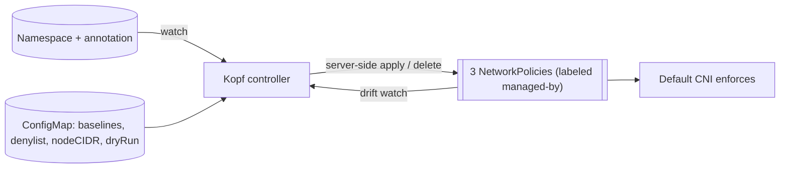

# NetworkPolicy Operator — Low-Level Design (Python / Kopf)

> Builds on [`NETWORK-POLICY-OPERATOR-HLD.md`](./NETWORK-POLICY-OPERATOR-HLD.md) (single-annotation model). Internal engineering doc.
>
> Single annotation: `truefoundry.com/allowed-ingress-namespaces` — **presence** enrolls a namespace; **value** (comma-separated names, empty allowed) lists extra ingress sources. Egress stays open.

## 1. Kyverno vs. custom operator — recommendation

**Recommendation: build a small Python operator (Kopf). Use Kyverno only if you want zero custom code and can accept its constraints for the add-on-only case.**

| Capability needed | Kyverno `generate` | Python (Kopf) operator |
|-------------------|--------------------|------------------------|
| Watch namespaces, generate 3 NetworkPolicies | ✅ (3 generate rules, `synchronize: true`) | ✅ |
| Drift correction / recreate on delete | ✅ `synchronize` | ✅ (watch + timer resync) |
| Background scan of existing namespaces | ✅ `generateExisting` | ✅ (on startup) |
| **Expand comma-list → N `from[]` entries** | ⚠️ Possible but gnarly JMESPath (`split` + projection + array concat) | ✅ Trivial Python |
| **Inject baseline allows** (gateway/monitoring/agent) + dedup | ⚠️ Array concat in JMESPath | ✅ Trivial |
| **Allow-before-deny ordering** | ❌ No apply-ordering control between generated resources | ✅ Explicit |
| **Input validation** (reject `*`, bad names, emit events) | ✅ via separate `validate` rules | ✅ |
| **Rich status/metrics/dry-run** | ❌ Limited | ✅ |
| Maintainability for the team | ⚠️ JMESPath/policy DSL | ✅ Python |
| Operational footprint | ✅ Already-present admission controller | One small Deployment |

**Why Kopf:** it's the de-facto Python operator framework (decorator-based handlers, built-in finalizers, peering/leader-election, retries/backoff, Prometheus metrics, event emission). It keeps the controller ~a few hundred lines and readable.

> If only **add-on namespaces** ever need this and the team is comfortable with JMESPath, a Kyverno PoC (sketch in §8) is acceptable. For the downtime-sensitive baseline + ordering logic across add-ons *and* workspaces, the Python operator is the safer, more maintainable choice.

## 2. Architecture

- **Runtime:** single Deployment (e.g. namespace `tfy-system`), 1 active replica via Kopf peering/leader-election (warm standby optional).
- **Watches:** `Namespace` (cluster-scoped) and the operator's own generated `NetworkPolicy` objects (for drift).
- **Config:** a ConfigMap (operator-level) holding baseline sources, denylist, optional node CIDR, dry-run flag.
- **Output:** three standard `networking.k8s.io/v1` NetworkPolicies per managed namespace, labeled `app.kubernetes.io/managed-by: tfy-netpol-operator`.



## 3. Operator configuration (ConfigMap)

```yaml
apiVersion: v1
kind: ConfigMap
metadata: { name: tfy-netpol-operator-config, namespace: tfy-system }
data:
  config.yaml: |
    # Always-allowed ingress sources injected into every managed namespace.
    # Prevents an empty/incomplete annotation from black-holing a namespace.
    baselineAllowedNamespaces:
      - ingress-nginx          # or istio-ingress / openshift-ingress per cluster
      - prometheus             # monitoring
      - tfy-agent              # control-plane <-> agent
    # Namespaces the operator must never touch (in addition to built-in kube-*/openshift-*).
    denylist:
      - kube-system
      - kube-public
      - kube-node-lease
      - tfy-system
    # Optional ipBlock injected to cover host-networked/kubelet edge cases (per cluster).
    nodeCIDRs: []              # e.g. ["10.0.0.0/16"]
    dryRun: true               # report-only: log intended policies, do not apply
```

Per-cluster values (baseline namespace names, node CIDR) live in this ConfigMap — the per-cluster overlay from the HLD rollout.

## 4. Reconcile logic

### 4.1 Triggers (Kopf handlers)

```python
import kopf

ANNOTATION = "truefoundry.com/allowed-ingress-namespaces"

@kopf.on.create("v1", "namespaces")
@kopf.on.resume("v1", "namespaces")          # re-sync on operator restart
@kopf.on.update("v1", "namespaces", field=f"metadata.annotations.{ANNOTATION.replace('.', '_')}")
def reconcile_ns(name, meta, logger, **_):
    reconcile(name, meta, logger)

@kopf.timer("v1", "namespaces", interval=300)  # periodic drift resync
def periodic(name, meta, logger, **_):
    reconcile(name, meta, logger)

# Drift: if a managed policy is deleted/edited, re-reconcile its namespace.
@kopf.on.delete("networking.k8s.io", "v1", "networkpolicies",
                labels={"app.kubernetes.io/managed-by": "tfy-netpol-operator"})
def policy_deleted(namespace, logger, **_):
    reconcile(namespace, get_ns_meta(namespace), logger)
```

> Note: deleting a **namespace** needs no cleanup handler — Kubernetes garbage-collects all NetworkPolicies in it automatically. Explicit cleanup is only needed when the **annotation is removed** but the namespace remains (handled in §4.3).

### 4.2 Core reconcile

```python
def reconcile(name, meta, logger):
    annotations = (meta or {}).get("annotations", {})

    if name in cfg.denylist or is_system_ns(name):
        return
    if ANNOTATION not in annotations:
        delete_managed_policies(name, logger)   # un-enrolled -> clean up
        return

    sources = parse_sources(annotations[ANNOTATION])     # split, trim, dedupe, drop self
    sources = dedupe(sources + cfg.baselineAllowedNamespaces)   # inject baselines
    validate(sources)                                     # reject "*", bad names -> event, skip bad

    deny  = build_default_deny_ingress(name)
    egr   = build_allow_all_egress(name)
    allow = build_allow_ingress(name, sources, cfg.nodeCIDRs)  # self + sources + optional ipBlock

    if cfg.dryRun:
        logger.info("DRY-RUN", policies=[deny, egr, allow]); return

    # ALLOW-BEFORE-DENY (fail-closed): apply allow + egress first; only then deny.
    apply(egr); apply(allow)        # server-side apply (idempotent upsert)
    apply(deny)                     # if the above raised, we never reach here
```

Key points:
- **`self` is always injected** into `allow` (HLD assumption).
- **Baselines injected** so an empty/incomplete annotation cannot black-hole a namespace (downtime risk #1/#4 from the review).
- **Allow-before-deny**: `apply(deny)` runs only after allow/egress succeed; an exception short-circuits, so we never leave deny-without-allow.
- **Server-side apply** with a fixed field manager → clean idempotent upserts and drift correction.

### 4.3 Generated objects

Identical to the HLD policy set, each carrying `labels: { app.kubernetes.io/managed-by: tfy-netpol-operator }`:
1. `tfy-np-default-deny-ingress` — `podSelector: {}`, `policyTypes: [Ingress]`.
2. `tfy-np-allow-egress` — `policyTypes: [Egress]`, `egress: [{}]`.
3. `tfy-np-allow-ingress` — `from: [self] + [namespaceSelector per source] + [ipBlock per nodeCIDR]`.

`delete_managed_policies(name)` deletes objects in the namespace matching the managed-by label.

### 4.4 Annotation parsing rules

- Empty/whitespace → only `self` + baselines.
- `*` → **rejected** by default (emit Warning event; treat as empty) to avoid accidental allow-all; opt-in flag can permit it.
- Trim, lowercase, dedupe; skip invalid DNS-1123 names with a Warning event; never fail the whole reconcile on one bad entry.

## 5. Failure handling & downtime guards

- **Fail-closed against deny:** if allow/egress apply fails, the deny is not applied that cycle; Kopf retries with backoff.
- **Baseline allows** guarantee gateway/monitoring/agent are always permitted.
- **Dry-run mode** (`dryRun: true`) for first rollout per cluster — logs intended policies without enforcing.
- **First-cutover guidance:** enable per namespace in a maintenance window; new namespaces are safe (no workloads yet).
- **Drift:** watch on managed policies + 5-min timer re-creates anything deleted/edited.
- **Idempotency:** server-side apply; no duplicate objects.

## 6. RBAC

```yaml
# ClusterRole (subset)
rules:
  - apiGroups: [""]
    resources: ["namespaces"]
    verbs: ["get", "list", "watch"]
  - apiGroups: ["networking.k8s.io"]
    resources: ["networkpolicies"]
    verbs: ["get", "list", "watch", "create", "update", "patch", "delete"]
  - apiGroups: [""]
    resources: ["events"]
    verbs: ["create", "patch"]
  # Kopf peering/leader-election (cluster or namespaced ClusterKopfPeering)
  - apiGroups: ["kopf.dev"]
    resources: ["clusterkopfpeerings"]
    verbs: ["list", "watch", "patch", "get"]
```

No write access to namespaces is required (we never mutate namespace metadata), which also limits the operator's own privilege/blast radius.

## 7. Packaging, HA, observability, testing

- **Packaging:** container image (`python:3.12-slim` + `kopf`, `kubernetes`, `pyyaml`); Helm chart (Deployment, RBAC, ConfigMap, peering CR). Delivered as a TrueFoundry add-on via Argo CD.
- **HA:** 1 active replica via Kopf peering (leader-election); optional standby. The controller is stateless (state is in the cluster).
- **Observability:** Kopf Prometheus metrics (handler counts/latency/errors); custom gauges (managed namespaces, policies reconciled, reconcile errors); Kubernetes Events on parse/validation issues; structured JSON logs. Enable per-CNI deny logs for debugging blocked flows.
- **Testing:** unit tests on `build_*`/`parse_sources` (golden-file rendered manifests); integration on kind/k3d with a policy-enforcing CNI (e.g. Cilium for CI) covering empty/list/`*`/invalid, allow-before-deny, drift recreate, un-enroll cleanup; e2e connectivity (negative test from an unlisted namespace).

## 8. Argo CD coexistence (important)

The operator generates NetworkPolicies that are **not** in any Argo CD Application's Git source. To prevent Argo from pruning or fighting them:

- Mark generated objects with the managed-by label and add an Argo **resource exclusion** (or `Application.spec.syncPolicy` ignore) for `NetworkPolicy` carrying that label in operator-managed namespaces, **or**
- Let the operator be the sole owner and ensure the add-on Applications do not set `prune: true` over those objects.

This resolves downtime risk #5 from the production review.

## 9. Kyverno alternative (fallback sketch)

If you choose Kyverno instead of the Python operator:

```yaml
apiVersion: kyverno.io/v1
kind: ClusterPolicy
metadata: { name: tfy-namespace-netpol }
spec:
  generateExisting: true
  rules:
    - name: deny-ingress
      match: { any: [{ resources: { kinds: [Namespace], annotations: { "truefoundry.com/allowed-ingress-namespaces": "?*" } } }] }
      # ...also a rule for empty value via a separate match...
      generate:
        synchronize: true
        apiVersion: networking.k8s.io/v1
        kind: NetworkPolicy
        name: tfy-np-default-deny-ingress
        namespace: "{{ request.object.metadata.name }}"
        data: { spec: { podSelector: {}, policyTypes: [Ingress] } }
    # + allow-egress rule, + allow-ingress rule that builds `from` from
    #   split(annotations."truefoundry.com/allowed-ingress-namespaces", ',')
    #   concatenated with baseline namespaces and self via JMESPath.
```

Limitations vs. the operator: no allow-before-deny ordering control, JMESPath list/baseline expansion is hard to read/maintain, weaker validation/observability. Acceptable for the simpler add-on-only case; not ideal for the full add-on + workspace scope.

## 10. Recommendation summary

Build the **Python/Kopf operator** (~a few hundred lines, easy to maintain, gives ordering + baselines + validation + observability that directly mitigate the production-downtime risks). Keep Kyverno as a documented fallback for an add-on-only, low-customization deployment.
